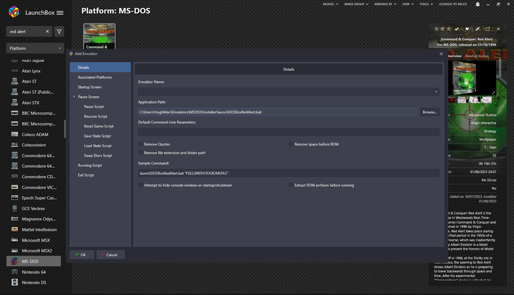
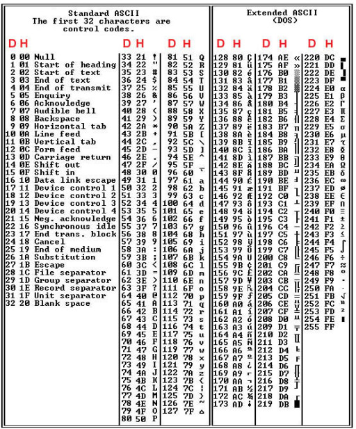

# Emulator ROM Launchers for Keyboard Consoles Using Launchbox Front-End

Launch scripts are to be used with Windows emulators using Launchbox (https://www.launchbox-app.com/) as a front end. I have had issues in regards to auto launching or booting into games themselves on certain platforms. This is dependent on a range of setup configuration issues, you might be able to correct this using the emulator settings, in some cases this is difficult or not possible. 

I created these scripts to basically type the correct command required to launch the game itself once the emulator is launched. The ROM & emulator are loaded by Launchbox, the emulator (within Launchbox) points to a .bat file that launches the emulator .exe file, once this is launched, it will run the python script on top to type the appropriate command

# Setup

Install the required modules by typing in the below in windows cmd

    pip install pywin32

This will install `win32api` & `win32con` that are needed to press and release the keys.

Place the .bat & .py files in the emulator directory and point Launchbox to the .bat file to start the emulator by adding your batch file into the Application Path as seen below

Change the path in the .bat file to match that of your emulator directory

## Creating Commands

The repo has some default commands I have built for MS-DOS and Amstrad CPC emulators (Caprice x64) but you can either adjust these or use the blank shell script provided & you can create a specfic command for yourself.

You will need to add decimal values to match the keys you require, there are many sources for this. You can use the table below, this repo (https://github.com/AliCW/ASCII-Identification), or just by googling it.

## Link to the general win32api module
http://timgolden.me.uk/pywin32-docs/win32api.html

## Link to the keybd_event documentation
http://timgolden.me.uk/pywin32-docs/win32api__keybd_event_meth.html

